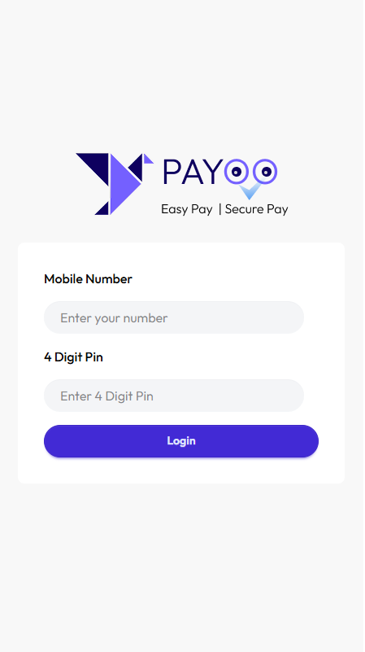
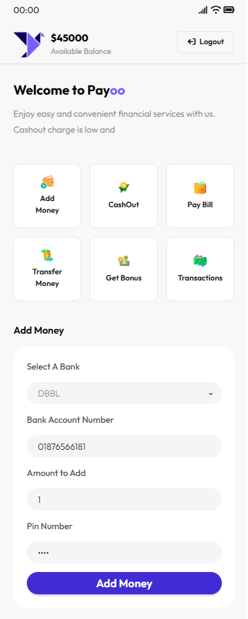
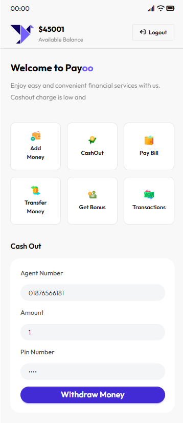
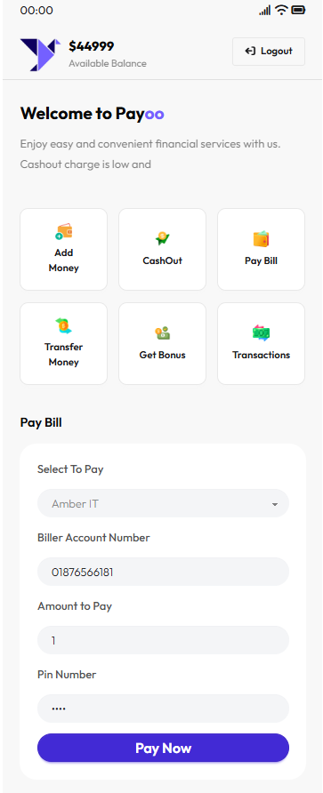
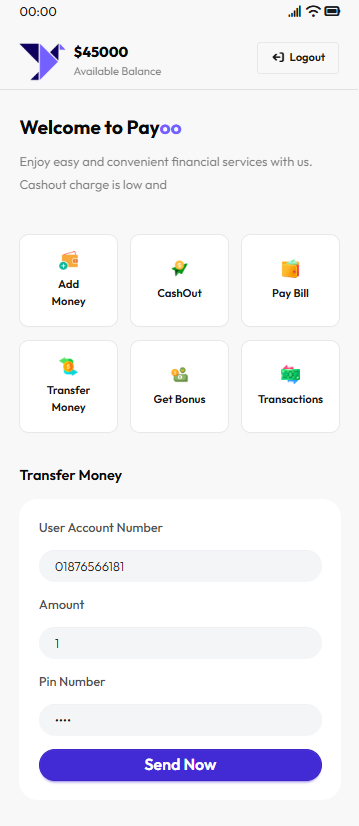
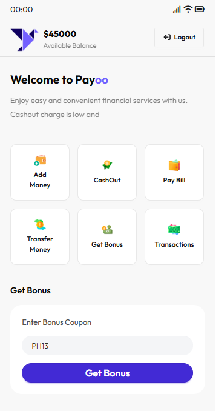
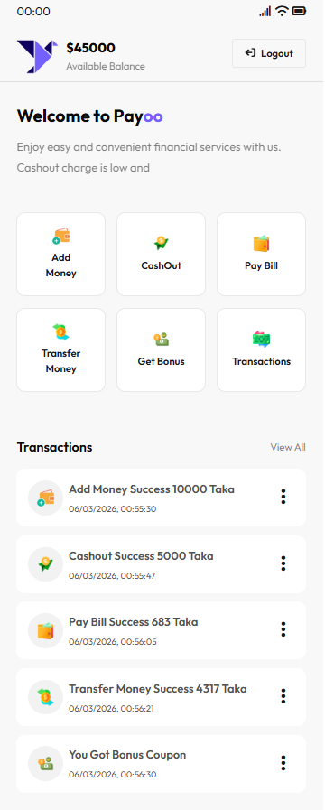

# 💳 Payoo - Digital Wallet Web App

Payoo is a simple **Digital Wallet Web Application** built with **HTML, Tailwind CSS, DaisyUI, and JavaScript**.
It simulates a mobile financial service where users can manage balance, add money, cash out, transfer money, pay bills, and view transaction history.

---

## UI 
<table>
    <tr>
        <td>
        
        </td>
        <td >
        
        </td>
    </tr>
    <tr>
        <td>
        
        </td>
        <td >
        
        </td>
    </tr>
    <tr>
        <td>
        
        </td>
        <td >
        
        </td>
    </tr>
    <tr>
        <td>
        
        </td>
        <td >
        
        </td>
    </tr>
    
</table>

 ---

## 🚀 Features

- * 💰 **Add Money** from bank account
- * 💸 **Cash Out** using agent number
- * 🧾 **Pay Bills** (WASA, DESCO, Amber IT)
- * 🔁 **Transfer Money** to another user
- * 🎁 **Get Bonus** using coupon codes
- * 📜 **Transaction History** to track all activities
- * 🔐 **PIN verification** for security
- * 📱 **Mobile-style UI** layout

---

## 🛠️ Technologies Used

- * **HTML5**
- * **Tailwind CSS**
- * **DaisyUI**
- * **JavaScript (DOM Manipulation)**
- * **Font Awesome**
- * **Google Fonts (Outfit)**

---

## 📂 Project Structure

```
Payoo/
- │
- ├── index.html
- ├── assets/
- │   ├── logo.png
- │   ├── opt-1.png
- │   ├── opt-2.png
- │   ├── opt-3.png
- │   ├── opt-4.png
- │   ├── opt-5.png
- │   └── opt-6.png
- │
- ├── script/
- │   ├── addMoney.js
- │   ├── cashout.js
- │   ├── payBill.js
- │   ├── transferMoney.js
- │   ├── getBonus.js
- │   └── machine.js
- │
- └── README.md
```

---

## 📱 Main Sections

### 🏠 Home Dashboard

Displays:

- * Current Balance
- * Quick Action Buttons
- * Navigation to wallet features

### 💰 Add Money

Users can add money by:

- * Selecting a bank
- * Entering bank account number
- * Entering amount
- * Confirming with PIN

### 💸 Cash Out

Withdraw money using:

- * Agent number
- * Withdrawal amount
- * PIN verification

### 🧾 Pay Bill

Pay utility bills such as:

- * WASA
- * DESCO
- * Amber IT

### 🔁 Transfer Money

Send money to another user account.

### 🎁 Get Bonus

Users can apply a **bonus coupon** to receive extra balance.

### 📜 Transactions

Displays all transaction history dynamically.

---

## 🔐 Security

Every financial action requires:

- * **4-digit PIN verification**
- * Input validation for numbers and amounts

---

## 🎨 UI Design

The interface is designed to look like a **mobile financial app** with:

- * Responsive layout
- * Card-style buttons
- * Clean financial dashboard
- * Smooth user experience

---

## ▶️ How to Run

- 1. Download or clone the repository

```
git clone https://github.com/your-username/payoo.git
```

- 2. Open the project folder

- 3. Run the **index.html** file in your browser

---

## 📌 Future Improvements

- * Login & authentication system
- * Database integration
- * Real transaction storage
- * Backend API integration
- * Mobile app version

---

## 👨‍💻 Author

**Nafiz Alam**
Frontend Web Developer (React.js)

- * HTML
- * Tailwind CSS
- * JavaScript
- * React.js

---

⭐ If you like this project, consider giving it a **star on GitHub**.
